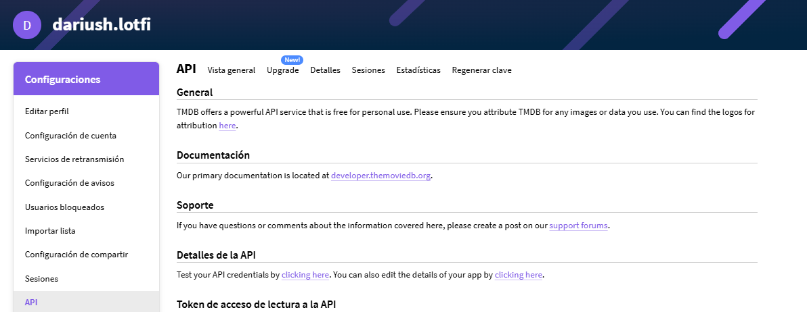
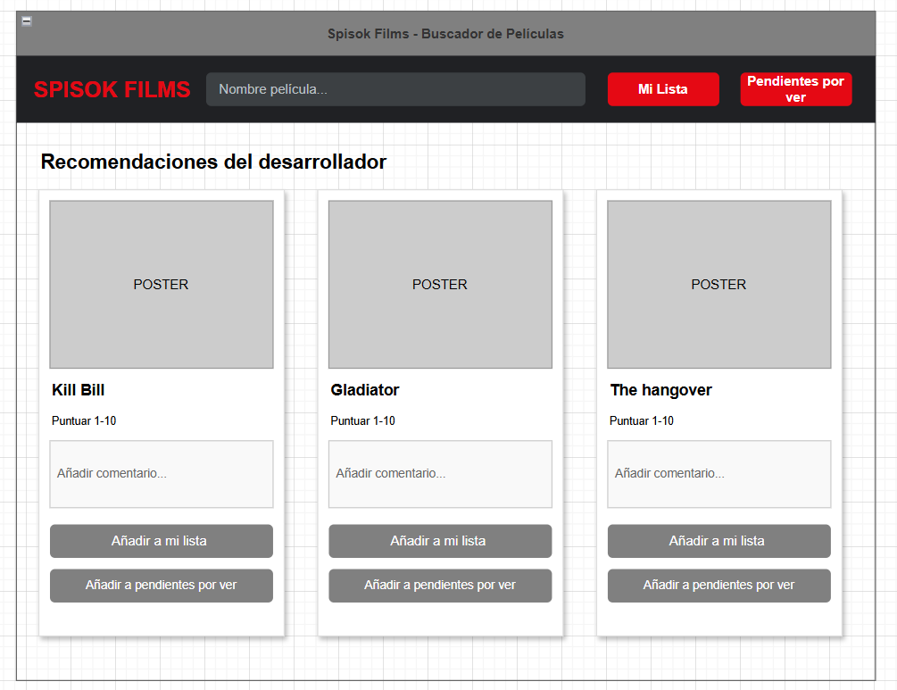
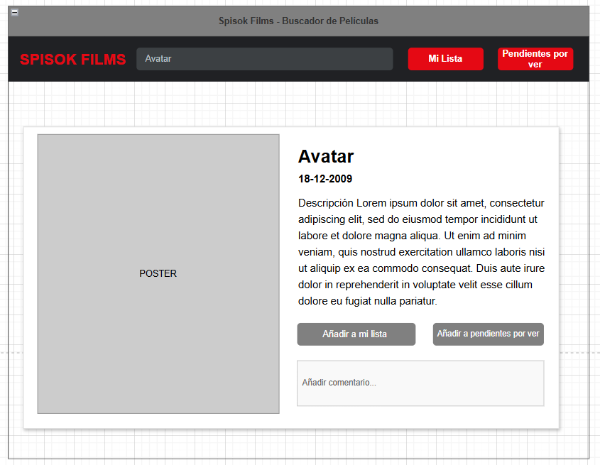

# Proyecto Final - Entrega 1
**Dariush Lotfi**
**2n DAW**  

### 1. Idea de proyecto

Mi idea al principio era crear la página web para la lampistería de mi padre pero es cierto que no cumpliría con los requisitos mínimos del proyecto (consultar a una API, conexión a bbdd). Por eso finalmente he decidido hacer una aplicación que utilice la API de TMDB (The Movie Database) https://www.themoviedb.org/

Para crear una web en la que puedas buscar, puntuar y guardar las películas que has visto, también otras funcionalidades como pendientes de ver.

Para acceder a la API se necesita API KEY, solo hace falta crear una cuenta.

Este proyecto va dirigido a la gente que quiera guardar un registro de las películas que ha visto, poder filtrar por fecha de estreno, por fecha de cuando has visto la película, por puntuación personal...
También tener una lista de pendientes de ver.

Con este proyecto podré aprender a crear una aplicación útil y funcional full stack desde la conexión a base de datos, backend y frontend.

### 2. Requisitos funcionales

**Registro y login:** El usuario podrá registrarse con email y contraseña e iniciar sesión. Las contraseñas se almacenan con hash seguro.

**Buscador de películas:** El usuario podrá buscar películas por título consumiendo la API de TMDB, y ver los resultados con póster, nota y año de estreno.

**Ficha de película:** Al hacer clic en una película se mostrará su información completa: sinopsis, reparto, género, duración, puntuación de TMDB, etc.

**Puntuar y comentar:** El usuario podrá puntuar películas y añadir un comentario personal.

**Lista de pendientes:** El usuario podrá guardar películas pendientes de ver para consultarlas más tarde.

**Mi lista (películas vistas):** El usuario podrá ver y filtrar las películas que ha visto según diferentes criterios: fecha de estreno, fecha en que la vio, puntuación personal, género, etc.

**Informes estadísticos:** Posibilidad de ver informes como películas vistas por mes, puntuación media, género más visto, etc.

**Recomendaciones con IA:** Un agente IA que recomiende películas según los gustos del usuario o a partir de una película concreta.

### 3. Mockup

 
 

### 4. Arquitectura y tecnologia

Frontend: HTML, CSS, JS
Backend: PHP
Base de datos: MySQL con phpMyAdmin
API externa: TMDB (The Movie Database) — API REST que devuelve datos de películas en formato JSON

**Estructura de la aplicación:**

La aplicación sigue el patrón MVC con PHP. El frontend consume la API de TMDB mediante fetch para obtener datos de películas (título, póster, sinopsis, puntuación). El backend PHP gestiona usuarios, favoritos, reseñas y listas de pendientes, conectándose a MySQL con PDO y prepared statements. La base de datos solo almacena datos propios (usuarios, favoritos, reseñas).

**Esquema de flujo:**

El usuario busca una película → JS hace fetch a TMDB → se muestran los resultados
El usuario marca como favorito → JS hace POST al backend PHP → PHP guarda user_id + tmdb_movie_id en MySQL
El usuario entra en "Mis favoritos" → PHP consulta MySQL → con los IDs obtenidos pide los datos a TMDB → devuelve la info completa al frontend
